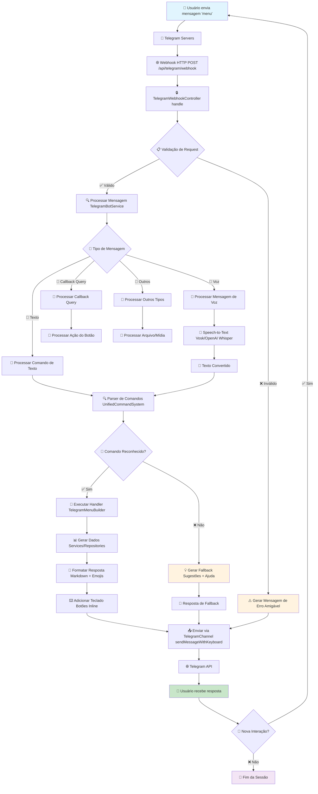
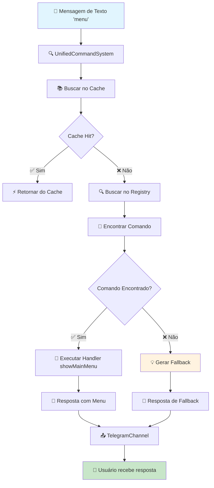
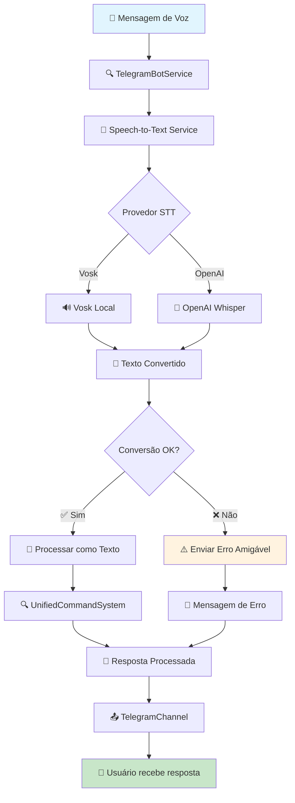
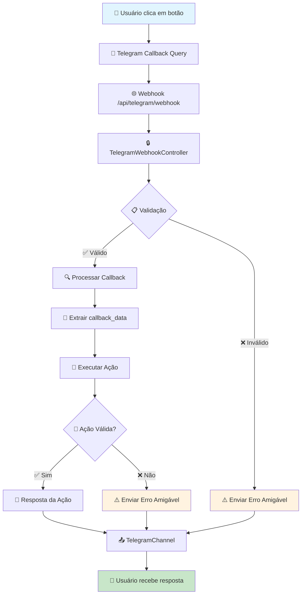
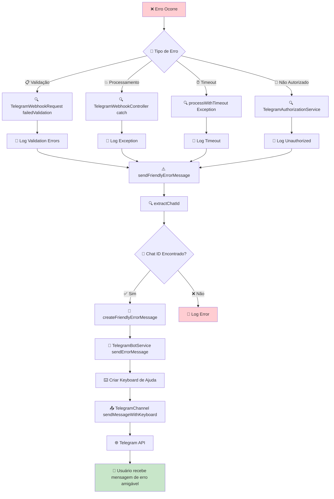
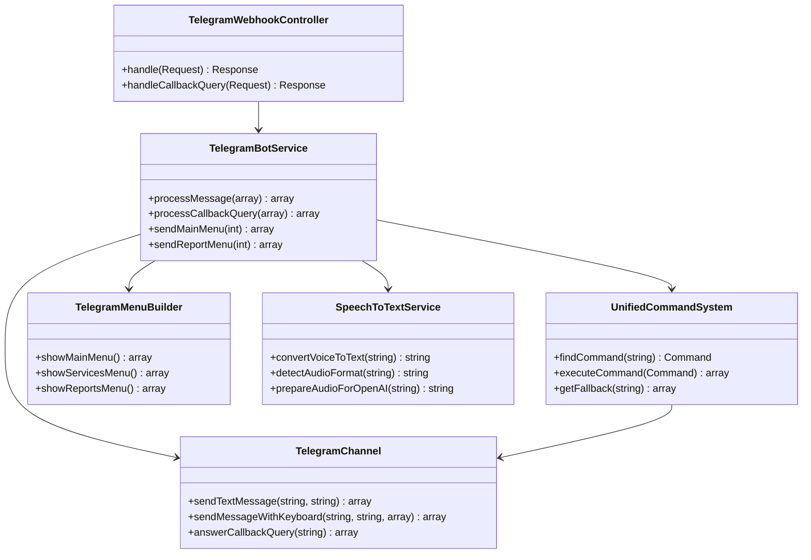
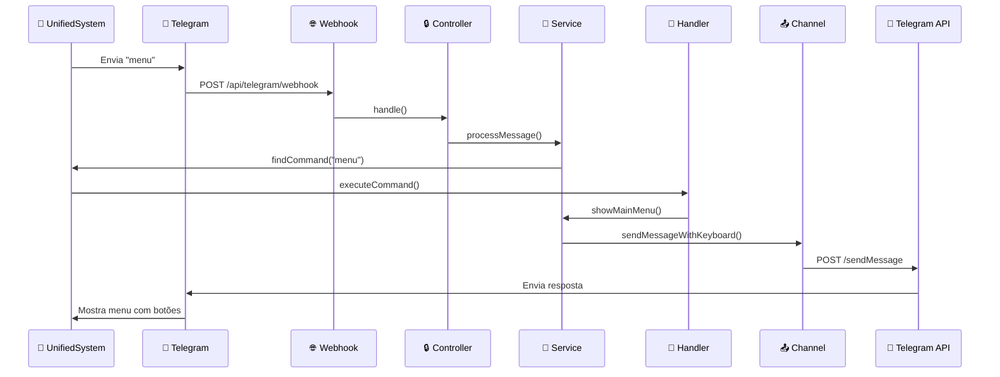
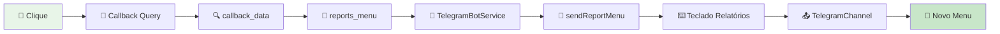

# 🔄 Fluxograma do Sistema Telegram - Rei do Óleo

## 🎯 Visão Geral

Este documento apresenta um fluxograma visual que mostra como uma mensagem do Telegram é processada pelo sistema, desde o envio pelo usuário até a resposta ser retornada.

## 📊 Fluxograma Principal

### **Fluxo Completo de Processamento**



## 🔍 Fluxo Detalhado por Tipo de Mensagem

### **1. Mensagem de Texto**



### **2. Mensagem de Voz**



### **3. Callback Query (Botões)**



## 🚨 Tratamento de Erros Amigável

### **Fluxo de Tratamento de Erros**



### **Mensagens de Erro Amigáveis**

| **Tipo de Erro**           | **Mensagem Amigável**                   | **Sugestões**                                                         |
| -------------------------- | --------------------------------------- | --------------------------------------------------------------------- |
| **Validação**              | ❌ Sua mensagem não pôde ser processada | • Verifique se está correta<br>• Tente novamente<br>• Use /help       |
| **Não Autorizado**         | 🚫 Você não tem permissão               | • Entre em contato com admin<br>• Use /help para comandos disponíveis |
| **Comando não encontrado** | 🤔 Comando não reconhecido              | • Use /help para ver comandos<br>• Verifique a ortografia             |
| **Timeout**                | ⏰ A operação demorou muito             | • Tente novamente<br>• Verifique sua conexão                          |
| **Erro interno**           | 💥 Ocorreu um erro interno              | • Nossa equipe foi notificada<br>• Tente novamente mais tarde         |
| **Webhook**                | 🔌 Erro na conexão                      | • Tente novamente<br>• Verifique sua conexão                          |

## 🔧 Implementação Técnica

### **1. TelegramWebhookController - Tratamento de Erros**

```php
// Captura erros de validação
if ($request->has('validation_errors')) {
    $validationErrors = $request->input('validation_errors');
    $errorMessage = $this->createValidationErrorMessage($validationErrors);

    // Envia mensagem amigável via Telegram
    $this->sendFriendlyErrorMessage($request->all(), $errorMessage);

    return TelegramWebhookResource::ignored('Validation failed - friendly message sent to user')
        ->response()
        ->setStatusCode(200);
}

// Captura erros de processamento
try {
    // Processamento da mensagem
} catch (\Exception $e) {
    // Envia mensagem amigável mesmo para exceções
    $this->sendFriendlyErrorMessage($request->all(), 'Desculpe, ocorreu um erro inesperado.');

    return TelegramWebhookResource::error('Internal server error')
        ->response()
        ->setStatusCode(500);
}
```

### **2. TelegramBotService - Envio de Mensagens de Erro**

```php
public function sendErrorMessage(int $chatId, string $errorMessage): array
{
    try {
        // Cria teclado com opções de ajuda
        $keyboard = [
            [
                ['text' => '❓ Ajuda', 'callback_data' => 'help'],
                ['text' => '🏠 Menu Principal', 'callback_data' => 'main_menu']
            ],
            [
                ['text' => '📋 Comandos', 'callback_data' => 'commands_list'],
                ['text' => '🔄 Tentar Novamente', 'callback_data' => 'retry']
            ]
        ];

        // Envia mensagem de erro com teclado de ajuda
        $result = $this->menuBuilder->buildMainMenu($chatId);

        return [
            'success' => true,
            'chat_id' => $chatId,
            'type' => 'error_message_sent',
            'message' => 'Error message sent to user',
            'data' => $result
        ];
    } catch (\Exception $e) {
        // Log do erro e retorno de falha
        return [
            'success' => false,
            'chat_id' => $chatId,
            'type' => 'error_message_failed',
            'message' => 'Failed to send error message'
        ];
    }
}
```

### **3. TelegramWebhookRequest - Validação Graceful**

```php
protected function failedValidation(\Illuminate\Contracts\Validation\Validator $validator): void
{
    // Log dos erros de validação
    $this->loggingService->logTelegramEvent('telegram_webhook_validation_failed', [
        'validation_errors' => $validator->errors()->toArray(),
        'request_data' => $this->all()
    ], 'error');

    // Armazena erros para o controller tratar
    $this->merge(['validation_errors' => $validator->errors()->toArray()]);

    // NÃO lança exceção - deixa o controller tratar graciosamente
    // parent::failedValidation($validator);
}
```

## 🧪 Testes e Validação

### **Comando de Teste**

```bash
# Testar tratamento de erros
php artisan telegram:test-error-handling --chat-id=123456789 --error-type=validation

# Testar todos os tipos de erro
php artisan telegram:test-error-handling --chat-id=123456789

# Testar erro específico
php artisan telegram:test-error-handling --chat-id=123456789 --error-type=internal
```

### **Cenários de Teste**

| **Cenário**         | **Entrada**                | **Resultado Esperado**                                |
| ------------------- | -------------------------- | ----------------------------------------------------- |
| **Validação falha** | Payload inválido           | ✅ Mensagem amigável enviada<br>✅ HTTP 200 retornado |
| **Erro interno**    | Exception no processamento | ✅ Mensagem amigável enviada<br>✅ HTTP 500 retornado |
| **Timeout**         | Processamento demora muito | ✅ Mensagem amigável enviada<br>✅ HTTP 500 retornado |
| **Não autorizado**  | Usuário sem permissão      | ✅ Mensagem amigável enviada<br>✅ HTTP 200 retornado |

## 📊 Benefícios da Implementação

### **✅ Para o Usuário:**

- **Sempre recebe feedback** - Nunca fica sem resposta
- **Mensagens claras** - Entende o que aconteceu
- **Sugestões úteis** - Sabe como proceder
- **Teclado de ajuda** - Acesso rápido a comandos úteis

### **✅ Para o Sistema:**

- **Logs completos** - Rastreamento de todos os erros
- **HTTP 200** - Webhook sempre responde com sucesso
- **Fallback robusto** - Sistema nunca quebra
- **Monitoramento** - Métricas de erros e sucessos

### **✅ Para o Desenvolvedor:**

- **Debugging fácil** - Erros são logados detalhadamente
- **Manutenção simples** - Código centralizado e organizado
- **Testes automatizados** - Comando de teste incluído
- **Documentação clara** - Fluxogramas e exemplos

## 🎯 Resumo da Implementação

A implementação técnica garante que **sempre** haja uma resposta amigável para o usuário, mesmo quando:

1. **❌ Validação falha** → Mensagem explicando o problema + sugestões
2. **💥 Erro interno** → Mensagem de erro + opções de ajuda
3. **⏰ Timeout** → Mensagem de timeout + sugestão de retry
4. **🚫 Não autorizado** → Mensagem de permissão + contato admin
5. **🤔 Comando não encontrado** → Sugestões de comandos disponíveis

**Resultado**: Usuário sempre recebe feedback útil e o sistema mantém logs completos para debugging, sem quebrar o fluxo do webhook.

## 🏗️ Arquitetura dos Componentes

### **Estrutura de Classes**



## 📊 Fluxo de Dados

### **Sequência de Processamento**



## 🎯 Casos de Uso Específicos

### **1. Comando Simples: "menu"**

```mermaid
flowchart LR
    A[👤 "menu"] --> B[🔍 Parser]
    B --> C[📚 Cache/Banco]
    C --> D[🎯 main_menu]
    D --> E[🚀 TelegramMenuBuilder]
    E --> F[📱 showMainMenu]
    F --> G[⌨️ Teclado + Botões]
    G --> H[📤 TelegramChannel]
    H --> I[📱 Resposta ao Usuário]

    style A fill:#e1f5fe
    style I fill:#c8e6c9
```

### **2. Comando de Voz: "quero ver o menu"**

```mermaid
flowchart LR
    A[🎤 Voz] --> B[🎵 Speech-to-Text]
    B --> C[📝 "quero ver o menu"]
    C --> D[🔍 Parser Natural]
    D --> E[🎯 main_menu]
    E --> F[🚀 TelegramMenuBuilder]
    F --> G[📱 showMainMenu]
    G --> H[⌨️ Teclado + Botões]
    H --> I[📤 TelegramChannel]
    I --> J[📱 Resposta ao Usuário]

    style A fill:#fce4ec
    style J fill:#c8e6c9
```

### **3. Callback Query: Botão "📊 Relatórios"**



## 🔧 Componentes Técnicos

### **Arquivos Principais**

| Componente         | Arquivo                         | Responsabilidade             |
| ------------------ | ------------------------------- | ---------------------------- |
| **Controller**     | `TelegramWebhookController.php` | Recebe webhooks e roteia     |
| **Service**        | `TelegramBotService.php`        | Lógica de negócio principal  |
| **Command System** | `UnifiedCommandSystem.php`      | Processamento de comandos    |
| **Channel**        | `TelegramChannel.php`           | Comunicação com Telegram API |
| **Menu Builder**   | `TelegramMenuBuilder.php`       | Construção de menus          |
| **Speech Service** | `SpeechToTextService.php`       | Conversão de voz para texto  |

### **Configurações Importantes**

```env
# Telegram Configuration
TELEGRAM_ENABLED=true
TELEGRAM_BOT_TOKEN=your_bot_token_here
TELEGRAM_RECIPIENTS=123456789,987654321

# Speech-to-Text
SPEECH_PROVIDER=vosk
VOSK_MODEL_PATH=/path/to/model

# Cache
TELEGRAM_COMMANDS_CACHE_ENABLED=true
TELEGRAM_COMMANDS_CACHE_TTL=1800
```

## 🚀 Como Testar o Fluxo

### **1. Teste Manual**

```bash
# 1. Envie mensagem para o bot
# 2. Verifique logs
tail -f storage/logs/laravel.log | grep "Telegram"

# 3. Teste comandos específicos
php artisan telegram:menu-test --menu=main
```

### **2. Teste de Comandos**

```bash
# Testar sistema de comandos
php artisan telegram:unified-commands list
php artisan telegram:unified-commands stats

# Testar speech-to-text
php artisan telegram:setup-speech --test
```

### **3. Monitoramento**

```bash
# Ver logs em tempo real
tail -f storage/logs/telegram-webhook.log

# Ver métricas
php artisan telegram:debug --get-updates
```

## 🔍 Troubleshooting

### **Problemas Comuns**

| Problema                    | Causa                    | Solução                                        |
| --------------------------- | ------------------------ | ---------------------------------------------- |
| **Webhook não recebido**    | URL incorreta            | `php artisan telegram:bot-setup --set-webhook` |
| **Comando não reconhecido** | Cache desatualizado      | `php artisan cache:clear`                      |
| **Voz não funciona**        | Provider não configurado | Configurar Vosk/OpenAI                         |
| **Botões não respondem**    | Callback mal configurado | Verificar `callback_data`                      |

### **Logs Importantes**

```bash
# Logs de webhook
grep "webhook" storage/logs/laravel.log

# Logs de comandos
grep "command" storage/logs/laravel.log

# Logs de voz
grep "speech" storage/logs/laravel.log
```

## 📈 Métricas e Monitoramento

### **KPIs Importantes**

- **Tempo de resposta** - < 2 segundos
- **Taxa de sucesso** - > 95%
- **Cache hit rate** - > 80%
- **Uptime** - > 99.9%

### **Alertas Recomendados**

- Webhook não recebido por > 5 minutos
- Taxa de erro > 5%
- Tempo de resposta > 5 segundos
- Cache miss rate > 30%

---

## 🎯 Resumo Executivo

O fluxo de processamento de mensagens do Telegram segue uma arquitetura modular e escalável:

1. **📥 Recepção** - Webhook recebe mensagens do Telegram
2. **🔍 Validação** - Request é validado e autenticado
3. **🎯 Processamento** - Sistema unificado processa comandos
4. **🚀 Execução** - Handlers específicos executam ações
5. **📤 Resposta** - Resposta formatada é enviada via API
6. **📱 Entrega** - Usuário recebe resposta no Telegram

**O sistema é robusto, rápido e oferece uma experiência de usuário excepcional!** 🚀✨

---

**📖 Para informações técnicas detalhadas, consulte:**

- `TELEGRAM_BOT_REPORTS.md` - Funcionalidades do bot
- `TELEGRAM_INTERACTIVE_MENUS.md` - Sistema de menus
- `TELEGRAM_VOICE_COMMANDS_IMPLEMENTATION.md` - Comandos de voz
- `UNIFIED_COMMAND_SYSTEM_USAGE.md` - Sistema unificado de comandos
