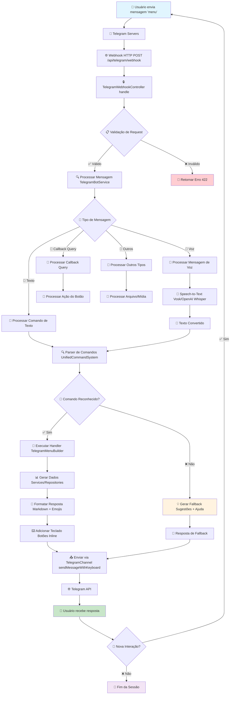
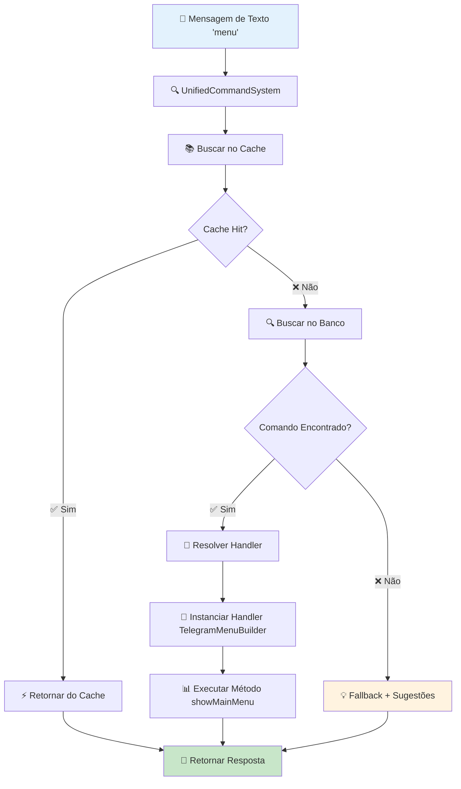
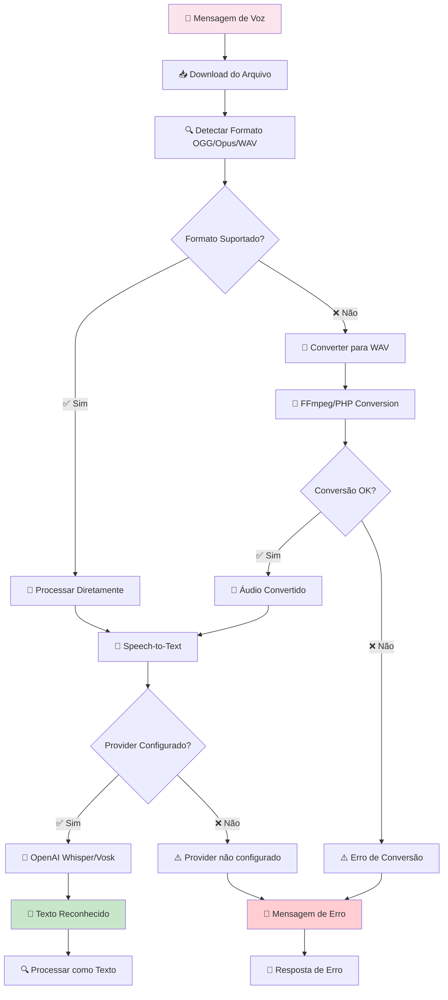
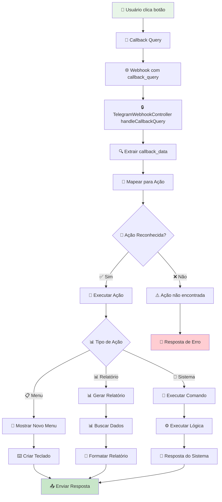
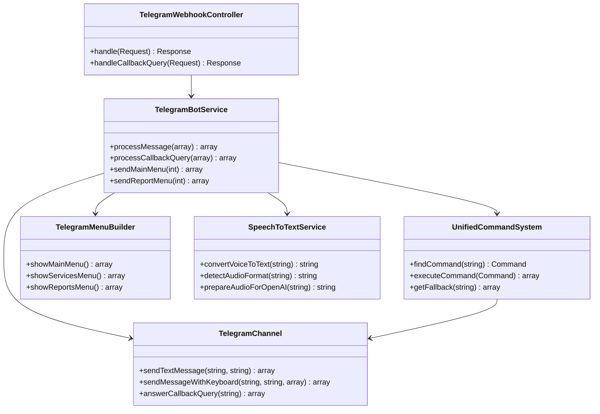
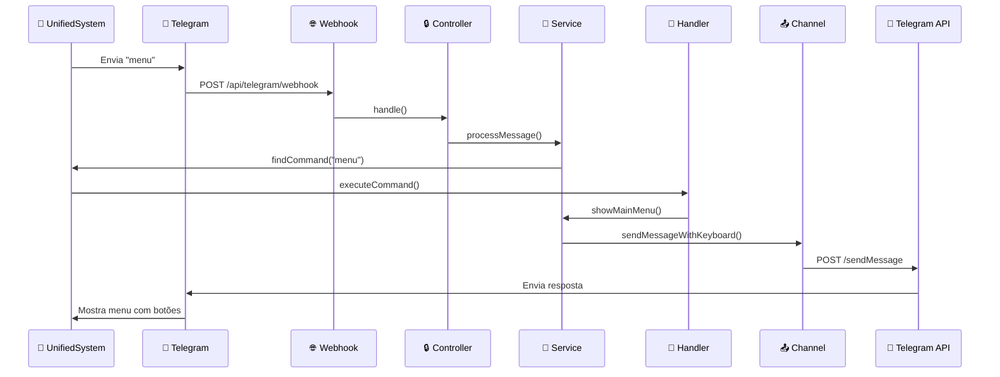
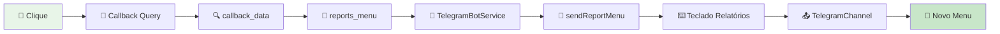

# 🔄 Fluxograma do Sistema Telegram - Rei do Óleo

## 🎯 Visão Geral

Este documento apresenta um fluxograma visual que mostra como uma mensagem do Telegram é processada pelo sistema, desde o envio pelo usuário até a resposta ser retornada.

## 📊 Fluxograma Principal

### **Fluxo Completo de Processamento**



## 🔍 Fluxo Detalhado por Tipo de Mensagem

### **1. Mensagem de Texto**



### **2. Mensagem de Voz**



### **3. Callback Query (Botões)**



## 🏗️ Arquitetura dos Componentes

### **Estrutura de Classes**



## 📊 Fluxo de Dados

### **Sequência de Processamento**



## 🎯 Casos de Uso Específicos

### **1. Comando Simples: "menu"**

```mermaid
flowchart LR
    A[👤 "menu"] --> B[🔍 Parser]
    B --> C[📚 Cache/Banco]
    C --> D[🎯 main_menu]
    D --> E[🚀 TelegramMenuBuilder]
    E --> F[📱 showMainMenu]
    F --> G[⌨️ Teclado + Botões]
    G --> H[📤 TelegramChannel]
    H --> I[📱 Resposta ao Usuário]

    style A fill:#e1f5fe
    style I fill:#c8e6c9
```

### **2. Comando de Voz: "quero ver o menu"**

```mermaid
flowchart LR
    A[🎤 Voz] --> B[🎵 Speech-to-Text]
    B --> C[📝 "quero ver o menu"]
    C --> D[🔍 Parser Natural]
    D --> E[🎯 main_menu]
    E --> F[🚀 TelegramMenuBuilder]
    F --> G[📱 showMainMenu]
    G --> H[⌨️ Teclado + Botões]
    H --> I[📤 TelegramChannel]
    I --> J[📱 Resposta ao Usuário]

    style A fill:#fce4ec
    style J fill:#c8e6c9
```

### **3. Callback Query: Botão "📊 Relatórios"**



## 🔧 Componentes Técnicos

### **Arquivos Principais**

| Componente         | Arquivo                         | Responsabilidade             |
| ------------------ | ------------------------------- | ---------------------------- |
| **Controller**     | `TelegramWebhookController.php` | Recebe webhooks e roteia     |
| **Service**        | `TelegramBotService.php`        | Lógica de negócio principal  |
| **Command System** | `UnifiedCommandSystem.php`      | Processamento de comandos    |
| **Channel**        | `TelegramChannel.php`           | Comunicação com Telegram API |
| **Menu Builder**   | `TelegramMenuBuilder.php`       | Construção de menus          |
| **Speech Service** | `SpeechToTextService.php`       | Conversão de voz para texto  |

### **Configurações Importantes**

```env
# Telegram Configuration
TELEGRAM_ENABLED=true
TELEGRAM_BOT_TOKEN=your_bot_token_here
TELEGRAM_RECIPIENTS=123456789,987654321

# Speech-to-Text
SPEECH_PROVIDER=vosk
VOSK_MODEL_PATH=/path/to/model

# Cache
TELEGRAM_COMMANDS_CACHE_ENABLED=true
TELEGRAM_COMMANDS_CACHE_TTL=1800
```

## 🚀 Como Testar o Fluxo

### **1. Teste Manual**

```bash
# 1. Envie mensagem para o bot
# 2. Verifique logs
tail -f storage/logs/laravel.log | grep "Telegram"

# 3. Teste comandos específicos
php artisan telegram:menu-test --menu=main
```

### **2. Teste de Comandos**

```bash
# Testar sistema de comandos
php artisan telegram:unified-commands list
php artisan telegram:unified-commands stats

# Testar speech-to-text
php artisan telegram:setup-speech --test
```

### **3. Monitoramento**

```bash
# Ver logs em tempo real
tail -f storage/logs/telegram-webhook.log

# Ver métricas
php artisan telegram:debug --get-updates
```

## 🔍 Troubleshooting

### **Problemas Comuns**

| Problema                    | Causa                    | Solução                                        |
| --------------------------- | ------------------------ | ---------------------------------------------- |
| **Webhook não recebido**    | URL incorreta            | `php artisan telegram:bot-setup --set-webhook` |
| **Comando não reconhecido** | Cache desatualizado      | `php artisan cache:clear`                      |
| **Voz não funciona**        | Provider não configurado | Configurar Vosk/OpenAI                         |
| **Botões não respondem**    | Callback mal configurado | Verificar `callback_data`                      |

### **Logs Importantes**

```bash
# Logs de webhook
grep "webhook" storage/logs/laravel.log

# Logs de comandos
grep "command" storage/logs/laravel.log

# Logs de voz
grep "speech" storage/logs/laravel.log
```

## 📈 Métricas e Monitoramento

### **KPIs Importantes**

- **Tempo de resposta** - < 2 segundos
- **Taxa de sucesso** - > 95%
- **Cache hit rate** - > 80%
- **Uptime** - > 99.9%

### **Alertas Recomendados**

- Webhook não recebido por > 5 minutos
- Taxa de erro > 5%
- Tempo de resposta > 5 segundos
- Cache miss rate > 30%

---

## 🎯 Resumo Executivo

O fluxo de processamento de mensagens do Telegram segue uma arquitetura modular e escalável:

1. **📥 Recepção** - Webhook recebe mensagens do Telegram
2. **🔍 Validação** - Request é validado e autenticado
3. **🎯 Processamento** - Sistema unificado processa comandos
4. **🚀 Execução** - Handlers específicos executam ações
5. **📤 Resposta** - Resposta formatada é enviada via API
6. **📱 Entrega** - Usuário recebe resposta no Telegram

**O sistema é robusto, rápido e oferece uma experiência de usuário excepcional!** 🚀✨

---

**📖 Para informações técnicas detalhadas, consulte:**

- `TELEGRAM_BOT_REPORTS.md` - Funcionalidades do bot
- `TELEGRAM_INTERACTIVE_MENUS.md` - Sistema de menus
- `TELEGRAM_VOICE_COMMANDS_IMPLEMENTATION.md` - Comandos de voz
- `UNIFIED_COMMAND_SYSTEM_USAGE.md` - Sistema unificado de comandos
