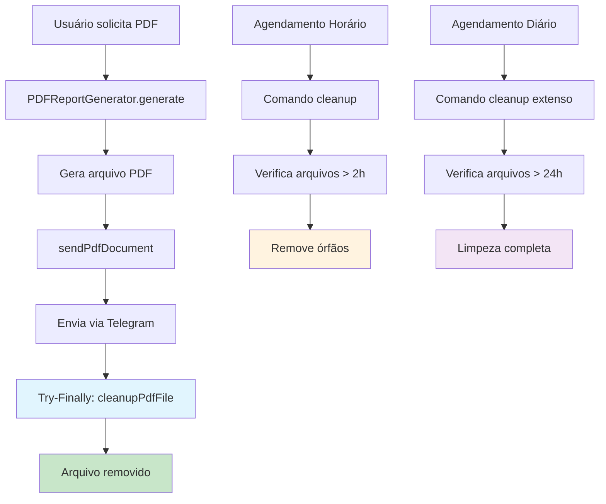

# 🧹 Sistema de Limpeza de PDFs Temporários - Telegram

## Visão Geral

O sistema de limpeza de PDFs temporários garante que os arquivos gerados para relatórios Telegram sejam automaticamente removidos do servidor, evitando acúmulo de arquivos desnecessários e uso excessivo de storage.

## 🔧 Funcionamento

### 1. Limpeza Automática Durante Envio

**Implementação**: `PDFReportGenerator::sendPdfDocument()`

```php
try {
    // Gera e envia PDF
    $result = $this->telegramChannel->sendDocument($chatId, $absolutePath, $caption);
    // Outras operações...

} catch (\Exception $e) {
    // Log de erro
    throw $e;
} finally {
    // SEMPRE limpa o arquivo, independente de sucesso ou falha
    $this->cleanupPdfFile($pdfPath);
}
```

**Características:**

- ✅ **Try-Finally**: Garante limpeza mesmo em caso de erro
- ✅ **Logs detalhados**: Registra todas as operações de limpeza
- ✅ **Fallback de erro**: Limpa arquivo se falha na geração

### 2. Comando Artisan para Limpeza

**Comando**: `php artisan telegram:cleanup-pdf-files`

#### Opções Disponíveis:

```bash
# Limpeza padrão (arquivos > 60 minutos)
php artisan telegram:cleanup-pdf-files

# Especificar idade dos arquivos
php artisan telegram:cleanup-pdf-files --minutes=120

# Modo dry-run (mostra o que seria deletado)
php artisan telegram:cleanup-pdf-files --dry-run

# Forçar sem confirmação
php artisan telegram:cleanup-pdf-files --force

# Combinações
php artisan telegram:cleanup-pdf-files --minutes=30 --dry-run
```

#### Exemplo de Saída:

```
🧹 Telegram PDF Cleanup
Looking for PDF files older than 60 minutes...

📄 Found 3 PDF files
🗑️ Found 2 files to delete:

+----------------------------+---------------+--------+---------------------+
| File                       | Age (minutes) | Size   | Last Modified       |
+----------------------------+---------------+--------+---------------------+
| report_general_123_old.pdf | 125.45        | 245 KB | 2024-01-01 10:30:15 |
| report_services_456_old.pdf| 89.32         | 180 KB | 2024-01-01 11:45:30 |
+----------------------------+---------------+--------+---------------------+
Total size: 425 KB

🎉 Cleanup completed!
✅ Deleted: 2 files (425 KB)
```

### 3. Agendamento Automático

**Arquivo**: `routes/console.php`

#### Agendamentos Configurados:

```php
// Limpeza de hora em hora (arquivos > 2 horas)
Schedule::command('telegram:cleanup-pdf-files --minutes=120 --force')
    ->hourly()
    ->name('telegram-pdf-cleanup')
    ->withoutOverlapping()
    ->runInBackground();

// Limpeza diária às 02:00 (arquivos > 24 horas)
Schedule::command('telegram:cleanup-pdf-files --minutes=1440 --force')
    ->daily()
    ->at('02:00')
    ->name('telegram-pdf-daily-cleanup')
    ->withoutOverlapping();
```

**Para ativar o agendamento:**

```bash
# Adicionar ao crontab do servidor
* * * * * cd /path/to/your/project && php artisan schedule:run >> /dev/null 2>&1
```

### 4. Limpeza Programática de Órfãos

**Método**: `PDFReportGenerator::cleanupOrphanedFiles()`

```php
// Via service
$pdfGenerator = app(PDFReportGenerator::class);
$result = $pdfGenerator->cleanupOrphanedFiles(60); // 60 minutos

// Resposta
[
    'success' => true,
    'message' => 'Cleaned up 3 orphaned files',
    'deleted_count' => 3,
    'total_size' => 1024000
]
```

## 📂 Estrutura de Arquivos

### Diretório de Storage

```
storage/app/private/telegram/reports/
├── report_general_123_2024-01-01_14-30-15.pdf
├── report_services_456_2024-01-01_14-32-45.pdf
└── report_products_789_2024-01-01_14-35-12.pdf
```

### Padrão de Nomenclatura

```
report_{type}_{chat_id}_{timestamp}.pdf

Exemplos:
- report_general_123456_2024-01-01_14-30-15.pdf
- report_services_789012_2024-01-01_15-45-30.pdf
```

## 📊 Logs e Monitoramento

### Eventos de Log Registrados

#### Limpeza Bem-sucedida:

```php
$this->loggingService->logTelegramEvent('pdf_file_cleaned_up', [
    'path' => 'telegram/reports/report_general_123.pdf',
    'file_size' => 245760
], 'info');
```

#### Falha na Limpeza:

```php
$this->loggingService->logTelegramEvent('pdf_cleanup_failed', [
    'path' => 'telegram/reports/report_general_123.pdf',
    'error' => 'Permission denied'
], 'warning');
```

#### Limpeza de Órfãos:

```php
$this->loggingService->logTelegramEvent('orphaned_cleanup_completed', [
    'total_files_checked' => 10,
    'deleted_count' => 3,
    'total_size_deleted' => 1024000,
    'cutoff_minutes' => 60
], 'info');
```

#### Comando de Limpeza:

```php
$this->loggingService->logTelegramEvent('pdf_cleanup_completed', [
    'total_files_found' => 5,
    'old_files_found' => 2,
    'deleted_count' => 2,
    'failed_count' => 0,
    'deleted_size' => 425984,
    'cutoff_minutes' => 60
], 'info');
```

### Consulta de Logs

```bash
# Logs específicos do Telegram
tail -f storage/logs/telegram.log | grep pdf_cleanup

# Filtrar por tipo de evento
grep "pdf_file_cleaned_up" storage/logs/telegram.log

# Estatísticas de limpeza
grep "orphaned_cleanup_completed" storage/logs/telegram.log | tail -10
```

## 🔧 Configurações

### Variáveis de Ambiente

```env
# Tempo padrão para considerar arquivo órfão (minutos)
TELEGRAM_PDF_ORPHAN_MINUTES=60

# Ativar limpeza automática
TELEGRAM_PDF_AUTO_CLEANUP=true

# Diretório de reports (relativo ao storage/app)
TELEGRAM_REPORTS_PATH=telegram/reports
```

### Configuração de Disk Storage

```php
// config/filesystems.php
'disks' => [
    'local' => [
        'driver' => 'local',
        'root' => storage_path('app/private'),
    ],
],
```

## 🚨 Segurança e Prevenção

### Proteções Implementadas:

1. **Nomes Únicos**: Arquivos com timestamp único evitam conflitos
2. **Limpeza Garantida**: Try-finally assegura remoção
3. **Logs Detalhados**: Rastreabilidade completa
4. **Sem Overlap**: Agendamentos evitam execução simultânea
5. **Validação de Caminho**: Só limpa arquivos na pasta correta

### Monitoramento Recomendado:

```bash
# Verificar espaço em disco usado pelos reports
du -sh storage/app/private/telegram/reports/

# Contar arquivos órfãos
find storage/app/private/telegram/reports/ -name "*.pdf" -mmin +60 | wc -l

# Listar arquivos mais antigos
find storage/app/private/telegram/reports/ -name "*.pdf" -exec ls -la {} \; | sort -k 6,7
```

## 🔄 Fluxo Completo de Limpeza



## 🧪 Testes e Validação

### Testes Manuais:

```bash
# 1. Criar arquivo de teste
mkdir -p storage/app/private/telegram/reports
echo "test" > storage/app/private/telegram/reports/test_$(date +%s).pdf

# 2. Testar dry-run
php artisan telegram:cleanup-pdf-files --minutes=0 --dry-run

# 3. Testar limpeza real
php artisan telegram:cleanup-pdf-files --minutes=0 --force

# 4. Verificar se arquivo foi removido
ls -la storage/app/private/telegram/reports/
```

### Testes de Carga:

```bash
# Criar múltiplos arquivos de teste
for i in {1..10}; do
    echo "test content $i" > storage/app/private/telegram/reports/test_${i}_$(date +%s).pdf
    sleep 1
done

# Testar limpeza em lote
php artisan telegram:cleanup-pdf-files --minutes=0 --force
```

## 📋 Troubleshooting

### Problemas Comuns:

#### 1. Diretório não existe

```bash
# Solução
mkdir -p storage/app/private/telegram/reports
chmod 755 storage/app/private/telegram/reports
```

#### 2. Permissões de arquivo

```bash
# Verificar permissões
ls -la storage/app/private/telegram/reports/

# Corrigir permissões
chmod 644 storage/app/private/telegram/reports/*.pdf
```

#### 3. Falha no agendamento

```bash
# Verificar se cron está configurado
crontab -l

# Testar comando manualmente
php artisan telegram:cleanup-pdf-files --dry-run

# Verificar logs do sistema
grep "telegram:cleanup" /var/log/syslog
```

#### 4. Arquivos não sendo limpos

```bash
# Verificar se path está correto
php artisan tinker
>>> Storage::disk('local')->exists('telegram/reports')

# Verificar logs de erro
grep "pdf_cleanup_failed" storage/logs/telegram.log
```

## 📈 Métricas de Sucesso

### KPIs para Monitorar:

1. **Taxa de Limpeza**: % de arquivos removidos com sucesso
2. **Tempo de Vida**: Tempo médio que arquivos ficam no servidor
3. **Espaço Liberado**: MB/GB limpos por período
4. **Arquivos Órfãos**: Quantidade de arquivos não limpos automaticamente
5. **Falhas de Limpeza**: Erros durante o processo

### Dashboard Sugerido:

```sql
-- Estatísticas de limpeza (logs)
SELECT
    DATE(created_at) as date,
    COUNT(*) as cleanups,
    SUM(JSON_EXTRACT(data, '$.file_size')) as bytes_cleaned
FROM activity_log
WHERE event = 'pdf_file_cleaned_up'
GROUP BY DATE(created_at)
ORDER BY date DESC;
```

---

**Sistema implementado e testado com sucesso! 🎉**

O sistema de limpeza garante que **nenhum arquivo PDF permanece no servidor** após ser enviado ao usuário do Telegram, com múltiplas camadas de proteção contra arquivos órfãos.
