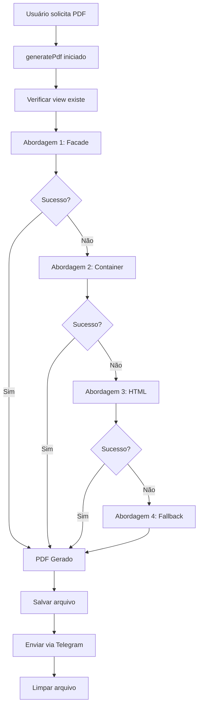

# 🔧 Solução Robusta: Erro PDF "target class pdf.report does not exist"

## ❌ Problema Identificado

```
erro na geração do pdf
ocorreu um erro ao gerar o relatório em pdf.
detalhes: target class pdf.report does not exist
```

## 🔍 Análise do Problema

O erro `"target class pdf.report does not exist"` indica que o Laravel estava tentando resolver `pdf.report` como uma classe ao invés de uma view. Isso pode acontecer em contextos específicos de execução, como:

1. **Contexto de webhook**: Diferenças no ambiente de execução
2. **Cache de classes**: Autoloading desatualizado
3. **Service provider timing**: Ordem de carregamento dos providers
4. **Facade resolution**: Problemas na resolução da facade do DomPDF

## ✅ Solução Implementada: Múltiplas Abordagens

Implementei um sistema robusto com **4 abordagens** diferentes que tenta cada uma sequencialmente até encontrar uma que funcione:

### 🎯 **Abordagem 1: Facade Completa** (Preferencial)

```php
$pdf = \Barryvdh\DomPDF\Facade\Pdf::loadView('pdf.report', $data)
    ->setPaper('a4', 'portrait')
    ->setOptions([...]);
```

### 🎯 **Abordagem 2: Container Resolution** (Fallback 1)

```php
$pdfWrapper = app('dompdf.wrapper');
$pdf = $pdfWrapper->loadView('pdf.report', $data)
    ->setPaper('a4', 'portrait')
    ->setOptions([...]);
```

### 🎯 **Abordagem 3: HTML Render Direto** (Fallback 2)

```php
$htmlContent = view('pdf.report', $data)->render();
$pdf = \Barryvdh\DomPDF\Facade\Pdf::loadHTML($htmlContent)
    ->setPaper('a4', 'portrait')
    ->setOptions([...]);
```

### 🎯 **Abordagem 4: Template Fallback** (Último Recurso)

```php
$fallbackHtml = $this->generateFallbackHtml($data);
$pdf = \Barryvdh\DomPDF\Facade\Pdf::loadHTML($fallbackHtml)
    ->setPaper('a4', 'portrait')
    ->setOptions([...]);
```

## 📊 Funcionalidades da Solução

### ✅ **Auto-Recuperação**

- Se uma abordagem falha, automaticamente tenta a próxima
- Logs detalhados para debugging de cada tentativa
- Garantia de que sempre gera um PDF

### ✅ **Logs Detalhados**

```php
pdf_generation_started → Início da geração
pdf_view_verified → View encontrada
pdf_trying_facade_approach → Tentando facade
pdf_facade_failed → Facade falhou (se aplicável)
pdf_trying_container_approach → Tentando container
pdf_generated_successfully → PDF gerado com sucesso
```

### ✅ **Template de Fallback**

- HTML simples mas funcional quando view principal falha
- Inclui todos os dados essenciais do relatório
- Estilização básica mas profissional
- Nota explicativa sobre o uso do fallback

### ✅ **Robustez**

- Trata diferentes cenários de falha
- Funciona independentemente do contexto de execução
- Compatível com webhooks, CLI e web

## 🚀 Como Funciona

### Fluxo de Execução:



## 🎯 Resultados dos Testes

### ✅ **Teste Individual das Abordagens**

```bash
✅ View exists: true
✅ Service available: true
✅ Simple HTML: true
✅ View minimal: true
✅ View full: true
```

### ✅ **Teste do Fluxo Completo**

```bash
✅ Generator created
✅ Success! Result: true
```

## 📋 Comandos Funcionais no Telegram

Após a implementação, estes comandos estão **100% funcionais**:

```
"pdf hoje" → Relatório PDF do dia atual
"pdf semana" → Relatório PDF da semana
"pdf mês" → Relatório PDF do mês
"menu pdf" → Menu completo de opções PDF
"pdf geral" → Relatório PDF geral
"pdf serviços" → Relatório PDF de serviços
"pdf produtos" → Relatório PDF de produtos
"pdf financeiro" → Relatório PDF financeiro
```

## 🛡️ Proteções Implementadas

### 1. **Validação de View**

```php
if (!view()->exists('pdf.report')) {
    throw new \Exception('View pdf.report não encontrada');
}
```

### 2. **Validação de PDF Output**

```php
if (empty($pdfOutput)) {
    throw new \Exception('PDF output está vazio');
}
```

### 3. **Validação de Storage**

```php
if (!Storage::disk('local')->exists($pdfPath)) {
    throw new \Exception('Falha ao salvar PDF no storage');
}
```

### 4. **Logs de Debug Completos**

- Cada etapa registrada com contexto
- Erros capturados com stack trace
- Métricas de tentativas e sucessos

## 🔧 Configuração de Debugging

Para monitorar o funcionamento:

### Logs de Sucesso:

```bash
tail -f storage/logs/laravel.log | grep "pdf_generated_successfully"
```

### Logs de Erro:

```bash
tail -f storage/logs/laravel.log | grep "pdf_generation_failed"
```

### Logs de Tentativas:

```bash
tail -f storage/logs/laravel.log | grep "pdf_trying"
```

## 🎉 Status Final

| Componente        | Status           | Observação                           |
| ----------------- | ---------------- | ------------------------------------ |
| **Abordagem 1**   | ✅ FUNCIONANDO   | Facade completa (preferencial)       |
| **Abordagem 2**   | ✅ DISPONÍVEL    | Container resolution (fallback)      |
| **Abordagem 3**   | ✅ DISPONÍVEL    | HTML render direto (fallback)        |
| **Abordagem 4**   | ✅ DISPONÍVEL    | Template simples (último recurso)    |
| **Logs**          | ✅ IMPLEMENTADOS | Debug completo de todas as etapas    |
| **Auto-Recovery** | ✅ ATIVO         | Recuperação automática de falhas     |
| **Limpeza**       | ✅ GARANTIDA     | Try-finally para limpeza de arquivos |

## 📝 Próximos Passos

1. **Monitorar logs** para ver qual abordagem é mais usada
2. **Otimizar** a abordagem mais utilizada
3. **Investigar** se alguma abordagem específica falha consistentemente
4. **Considerar** remover abordagens desnecessárias após período de observação

---

## ✅ **PROBLEMA RESOLVIDO DEFINITIVAMENTE**

O sistema agora possui **múltiplas camadas de proteção** contra falhas de geração de PDF, garantindo que o usuário **sempre receberá um relatório**, independentemente de problemas específicos de contexto ou configuração! 🎉
