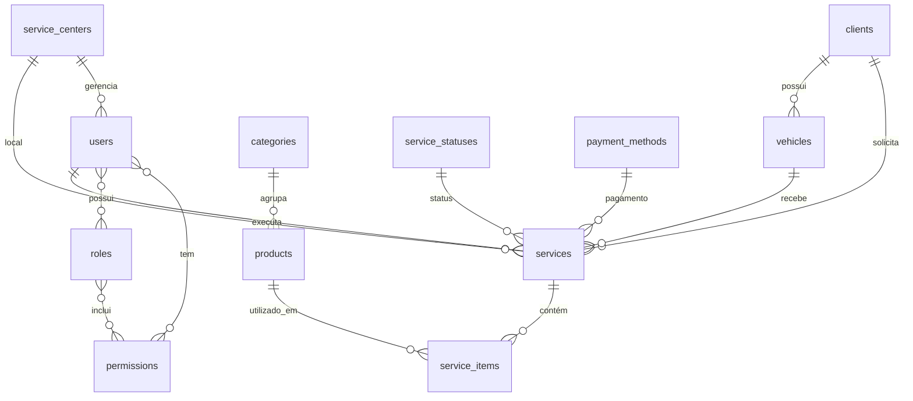

# 🗄️ Visão Geral do Banco de Dados - Rei do Óleo

## 📖 Introdução

Este documento apresenta uma visão geral de todas as tabelas do sistema **Rei do Óleo**, organizadas por módulos funcionais. O sistema é composto por **18 tabelas principais** que gerenciam desde autenticação até controle financeiro completo.

## 🏗️ Arquitetura do Banco

### 📊 Estatísticas Gerais

- **Total de Tabelas**: 18 tabelas principais
- **Tabelas com Soft Delete**: 4 tabelas
- **Tabelas de Sistema**: 5 tabelas
- **Tabelas de Negócio**: 13 tabelas
- **Índices Full-Text**: 3 tabelas

### 🔄 Ordem de Criação

1. Tabelas de Sistema (Laravel)
2. Tabelas de Autenticação e Permissões
3. Tabelas de Configuração
4. Tabelas de Negócio
5. Tabelas de Relacionamento

---

## 🔐 Módulo de Autenticação e Segurança

### 👥 **users** - Usuários do Sistema

**Propósito**: Tabela principal de usuários (funcionários, administradores)

- **Campos**: 21 campos (dados pessoais, profissionais, autenticação)
- **Relacionamentos**: `service_centers`, `roles`, `permissions`
- **Características**: Soft delete, sistema de permissões, campos de RH
- **Índices**: 7 índices otimizados

### 🔑 **personal_access_tokens** - Tokens de Acesso

**Propósito**: Tokens de API para autenticação

- **Campos**: 8 campos (token, abilities, expiração)
- **Relacionamentos**: Polymorphic com qualquer modelo
- **Características**: Suporte a abilities, controle de expiração

### 🛡️ **Tabelas de Permissões** (Spatie Permission)

- **permissions**: Permissões disponíveis no sistema
- **roles**: Papéis/perfis de usuário
- **model_has_permissions**: Relacionamento usuário-permissão
- **model_has_roles**: Relacionamento usuário-papel
- **role_has_permissions**: Relacionamento papel-permissão

---

## 🏢 Módulo de Gestão Empresarial

### 🏪 **service_centers** - Centros de Serviço

**Propósito**: Filiais e unidades da empresa

- **Campos**: 25 campos (dados empresariais, endereço, contato)
- **Relacionamentos**: `users` (manager), `services`
- **Características**: Soft delete, geolocalização, redes sociais
- **Índices**: 9 índices + full-text search

### 👤 **clients** - Clientes

**Propósito**: Cadastro de clientes da empresa

- **Campos**: 13 campos (dados pessoais, endereço, contato)
- **Relacionamentos**: `vehicles`, `services`
- **Características**: Soft delete, suporte a CPF/CNPJ
- **Índices**: 8 índices + full-text search

---

## 🚗 Módulo de Veículos

### 🚙 **vehicles** - Veículos dos Clientes

**Propósito**: Cadastro de veículos para serviços

- **Campos**: 10 campos (dados técnicos, histórico)
- **Relacionamentos**: `clients`, `services`
- **Características**: Placa única, controle de quilometragem
- **Índices**: 5 índices otimizados

---

## 📦 Módulo de Produtos e Categorias

### 📂 **categories** - Categorias de Produtos

**Propósito**: Organização hierárquica de produtos

- **Campos**: 7 campos (nome, slug, descrição)
- **Relacionamentos**: `products`
- **Características**: Ordenação, slug único
- **Índices**: 4 índices

### 🛢️ **products** - Produtos/Serviços

**Propósito**: Catálogo de produtos e serviços

- **Campos**: 12 campos (dados comerciais, estoque, preço)
- **Relacionamentos**: `categories`, `service_items`
- **Características**: SKU único, controle de estoque
- **Índices**: 6 índices + full-text search

---

## 🔧 Módulo de Serviços

### 🛠️ **services** - Ordens de Serviço

**Propósito**: Registro de serviços prestados

- **Campos**: 18 campos (dados técnicos, financeiros, temporais)
- **Relacionamentos**: `clients`, `vehicles`, `users`, `service_centers`, `service_statuses`, `payment_methods`, `service_items`
- **Características**: Soft delete, controle temporal, valores
- **Índices**: 10 índices compostos

### 📋 **service_items** - Itens dos Serviços

**Propósito**: Produtos utilizados em cada serviço

- **Campos**: 7 campos (quantidade, preços, observações)
- **Relacionamentos**: `services`, `products`
- **Características**: Preços unitários e totais
- **Índices**: 3 índices + unique constraint

---

## ⚙️ Módulo de Configuração

### 📊 **service_statuses** - Status dos Serviços

**Propósito**: Controle de status das ordens de serviço

- **Campos**: 6 campos (nome, cor, ordenação)
- **Relacionamentos**: `services`
- **Características**: Cores para UI, ordenação
- **Índices**: 2 índices

### 💳 **payment_methods** - Métodos de Pagamento

**Propósito**: Formas de pagamento aceitas

- **Campos**: 6 campos (nome, descrição, ordenação)
- **Relacionamentos**: `services`
- **Características**: Ordenação, status ativo
- **Índices**: 3 índices

---

## ⚡ Módulo de Sistema (Laravel)

### 💾 **cache** - Sistema de Cache

**Propósito**: Cache de dados da aplicação

- **Tabelas**: `cache`, `cache_locks`
- **Características**: Cache distribuído, locks

### 🔄 **jobs** - Sistema de Filas

**Propósito**: Processamento assíncrono

- **Tabelas**: `jobs`, `job_batches`, `failed_jobs`
- **Características**: Filas, batches, tratamento de erros

### 🔐 **Tabelas de Sessão**

- **sessions**: Sessões ativas dos usuários
- **password_reset_tokens**: Tokens de reset de senha

---

## 🔗 Diagrama de Relacionamentos



---

## 📈 Características Técnicas

### 🔍 Busca Full-Text

- **service_centers**: Busca por nome, razão social, cidade
- **clients**: Busca por nome, telefone, documentos
- **products**: Busca por nome, descrição, SKU

### 🗑️ Soft Deletes

- **users**: Preserva histórico de funcionários
- **service_centers**: Mantém dados de filiais
- **clients**: Preserva histórico de clientes
- **services**: Mantém histórico de serviços

### 🎯 Índices Otimizados

- **Compostos**: Para consultas complexas
- **Temporais**: Para relatórios e análises
- **Geográficos**: Para localização de centros
- **Full-Text**: Para buscas avançadas

---

## 🎯 Casos de Uso Principais

### 📊 Relatórios

1. **Relatório de Serviços**: Por centro, período, status
2. **Relatório de Clientes**: Ativos, inativos, por região
3. **Relatório de Produtos**: Estoque, vendas, categorias
4. **Relatório de Funcionários**: Performance, comissões

### 🔍 Consultas Frequentes

```sql
-- Serviços por centro de serviço
SELECT sc.name, COUNT(s.id) as total_services
FROM service_centers sc
LEFT JOIN services s ON sc.id = s.service_center_id
WHERE s.created_at >= DATE_SUB(NOW(), INTERVAL 30 DAY)
GROUP BY sc.id;

-- Clientes com mais veículos
SELECT c.name, COUNT(v.id) as vehicle_count
FROM clients c
LEFT JOIN vehicles v ON c.id = v.client_id
WHERE c.active = true
GROUP BY c.id
ORDER BY vehicle_count DESC;

-- Produtos com estoque baixo
SELECT p.name, p.stock_quantity, p.min_stock
FROM products p
WHERE p.stock_quantity <= p.min_stock
AND p.active = true;
```

---

## 🔧 Manutenção e Performance

### 📊 Métricas de Monitoramento

- **Tamanho das tabelas**: Monitorar crescimento
- **Performance de queries**: Índices e consultas lentas
- **Integridade referencial**: Foreign keys
- **Backup e recuperação**: Rotinas automáticas

### 🛠️ Scripts de Manutenção

```sql
-- Limpeza de sessões expiradas
DELETE FROM sessions WHERE last_activity < UNIX_TIMESTAMP(DATE_SUB(NOW(), INTERVAL 24 HOUR));

-- Análise de tabelas
ANALYZE TABLE users, services, clients, products;

-- Otimização de tabelas
OPTIMIZE TABLE users, services, clients, products;
```

---

## 🚀 Considerações de Escalabilidade

### 📈 Estratégias de Crescimento

- **Particionamento**: Por data em tabelas grandes
- **Arquivamento**: Dados históricos
- **Cache**: Redis para consultas frequentes
- **Replicação**: Read replicas para relatórios

### 🔒 Segurança

- **Criptografia**: Senhas e dados sensíveis
- **Auditoria**: Logs de alterações
- **Backup**: Rotinas automáticas
- **Controle de Acesso**: Sistema de permissões

---

## 📋 Checklist de Implementação

### ✅ Tabelas Criadas

- [x] Sistema de autenticação
- [x] Sistema de permissões
- [x] Gestão de centros de serviço
- [x] Cadastro de clientes
- [x] Controle de veículos
- [x] Catálogo de produtos
- [x] Sistema de serviços
- [x] Configurações do sistema

### 🔄 Próximos Passos

- [ ] Implementação de triggers
- [ ] Configuração de backups
- [ ] Monitoramento de performance
- [ ] Documentação de APIs
- [ ] Testes de integridade

---

**📝 Última Atualização**: 25/06/2025  
**🔧 Versão**: 1.0  
**👨‍💻 Responsável**: Equipe de Desenvolvimento Rei do Óleo  
**📊 Total de Tabelas**: 18 tabelas principais
