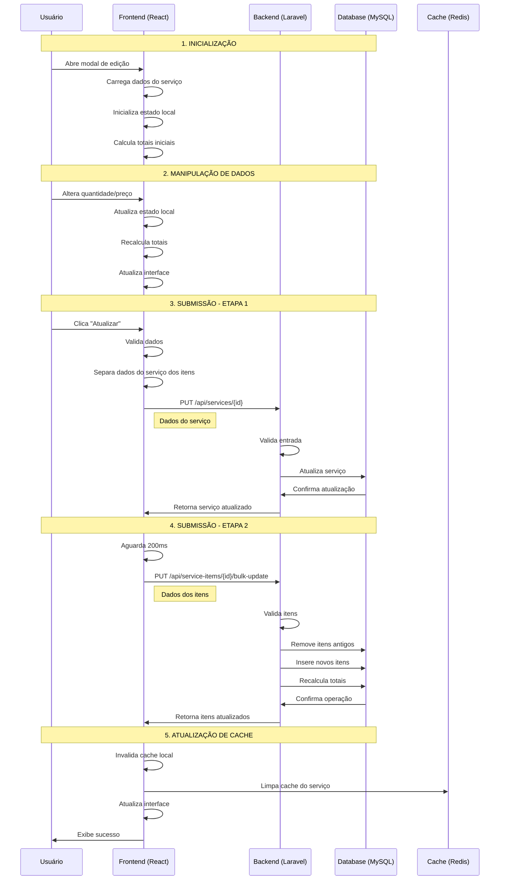
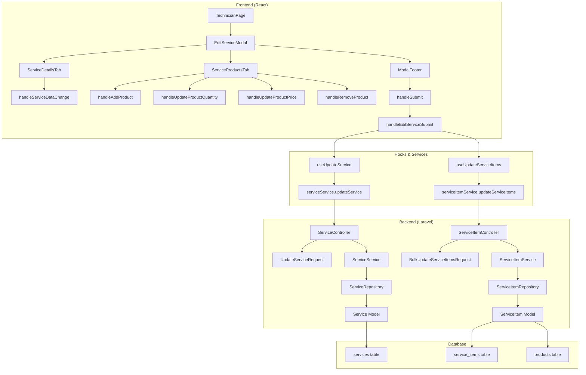
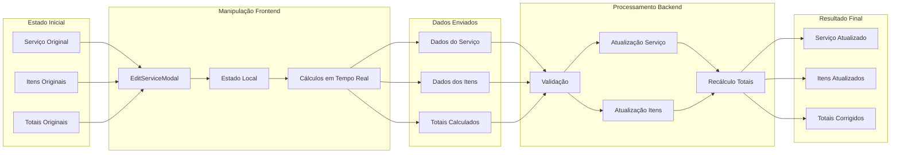
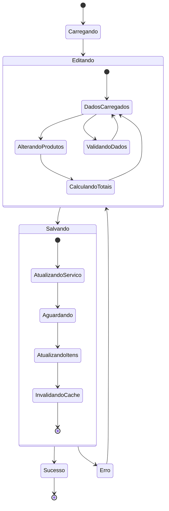
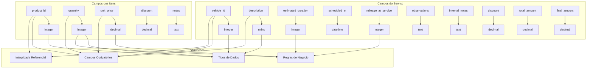
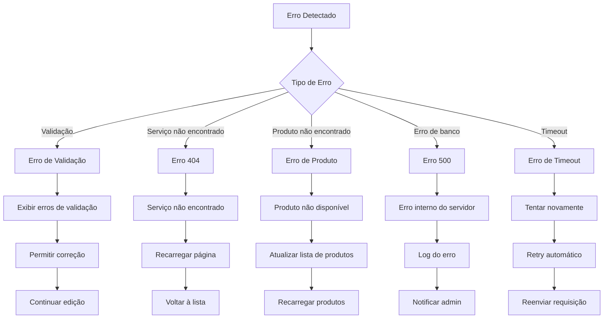
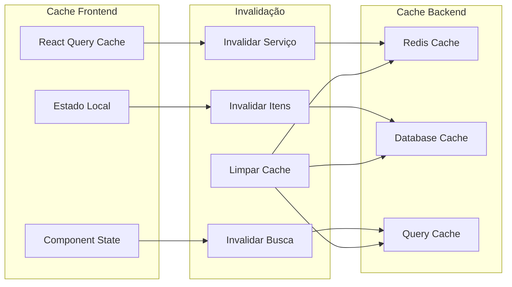

# 🔄 Diagrama do Fluxo de Atualização de Serviço

## 📊 Fluxo Completo

## 🏗️ Arquitetura de Componentes

## 📊 Fluxo de Dados

## 🔄 Estados e Transições

## 📋 Campos e Validações

## ⚠️ Tratamento de Erros

## 🔄 Cache e Sincronização

---

## 📝 Legenda

### **Símbolos**

- 🔄 **Fluxo de dados**: Movimento de informações entre camadas
- ⚛️ **Componente React**: Interface do usuário
- 🐘 **Serviço Laravel**: Lógica de negócio
- 🗄️ **Database**: Armazenamento persistente
- 💾 **Cache**: Armazenamento temporário
- ⚠️ **Erro**: Tratamento de exceções
- ✅ **Sucesso**: Operação concluída

### **Cores**

- 🔵 **Azul**: Frontend/Interface
- 🟢 **Verde**: Backend/Serviços
- 🟡 **Amarelo**: Database/Cache
- 🔴 **Vermelho**: Erros/Problemas
- 🟢 **Verde**: Sucesso/Conclusão

---

**📖 Este diagrama complementa a documentação técnica do fluxo de atualização de serviços.**
